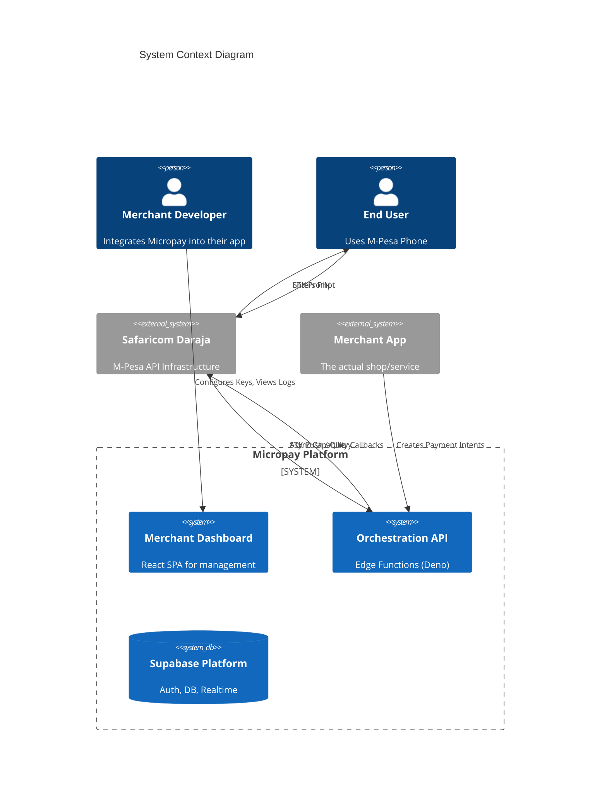
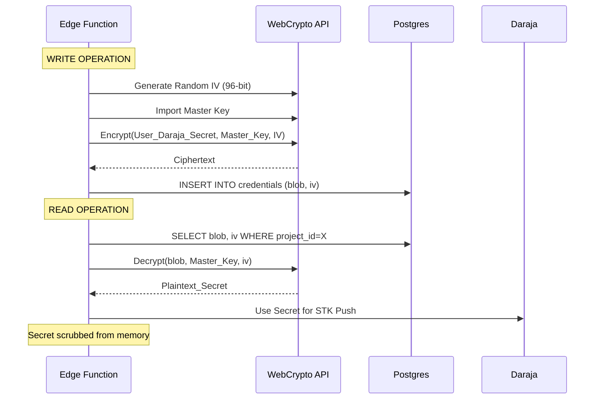
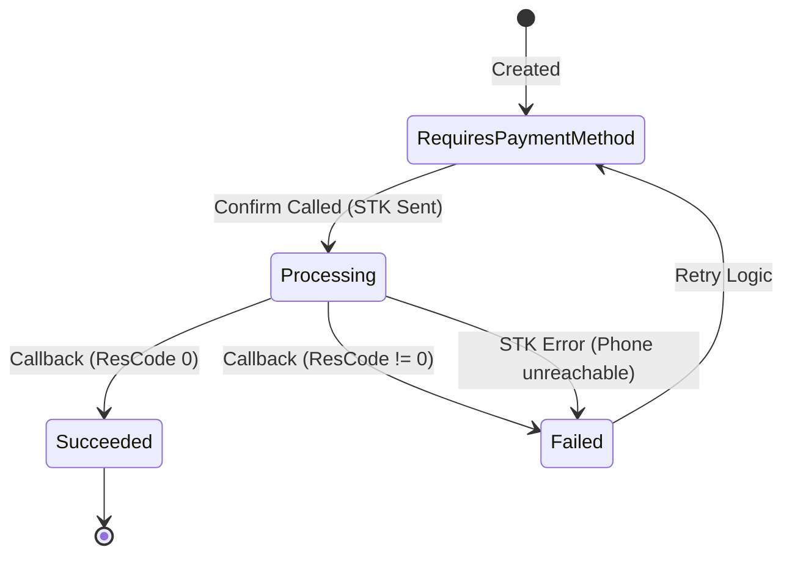

# Micropay System Architecture v2.0

> **Status**: Production-Ready Draft
> **Author**: Engineering Team
> **Last Updated**: 2024

This document serves as the authoritative technical reference for the Micropay platform. It details the full-stack architecture, data flows, security models, and integration patterns used to orchestrate M-Pesa payments.

---

## 1. System Context & Design Philosophy

Micropay is an **API-first Payment Orchestration Layer**. It sits between merchant applications and the Safaricom M-Pesa (Daraja) infrastructure.

**Core Philosophy:**
1.  **Orchestration over Gateway**: We do not hold funds. We orchestrate the API calls so funds move directly from Customer -> Merchant.
2.  **Intent-Based API**: We abstract the asynchronous, callback-heavy nature of M-Pesa into a synchronous-feeling "Payment Intent" resource (inspired by Stripe).
3.  **Security by Design**: Credentials are never stored in plaintext; they are vaulted and only decrypted in volatile memory during execution.

### System Landscape

---

## 2. Frontend Architecture (Apps & SDKs)

The frontend ecosystem consists of the Administration Dashboard and the Client SDKs.

### 2.1 Technology Stack
*   **Runtime**: Browser / Node.js
*   **Core Framework**: React 18 + Vite (Dashboard)
*   **Networking**: Native `fetch` with custom middleware for Auth via `supabase-js`.
*   **Styling**: Vanilla CSS Variables + Utility Classes (No preprocessors, ensuring near-zero build config).
*   **Distribution**: Monorepo managed by NPM Workspaces.

### 2.2 Component Hierarchy & State
The Dashboard (`apps/web`) follows a strict provider pattern:

1.  **`AuthProvider`**: Wraps the app. Listens to Supabase GoTrue limits. Handles JWT persistence in `localStorage`.
2.  **`MicropayProvider`**: (In the SDK) Holds the public key config.
3.  **`DashboardLayout`**: Handles the sidebar state and Environment Context (`sandbox` vs `production`).

**Key Architectural Decision**:
*   *Dual-Mode UI*: The UI does not reload when switching environments. It creates a "View Context" that filters all API requests with a header `x-micropay-env: sandbox|production`.

### 2.3 Security Measures
*   **XSS Protection**: All user inputs sanitized by React default escaping.
*   **CSP**: Strict Content Security Policies to only allow connections to `functions.v1`.
*   **JWT Handling**: Access tokens are short-lived (1 hour). Refresh tokens are rotated automatically by the Supabase client.

---

## 3. Backend Architecture (The Edge Monolith)

Unlike traditional microservices, Micropay uses a **Monolith-on-Edge** pattern. A single deployment unit (`micropay-api`) handles all business logic, routed internally.

### 3.1 The Edge Runtime (Deno)
*   **Global Distribution**: Code runs on roughly 30 regions worldwide (via Supabase Edge Network).
*   **Cold Starts**: < 200ms.
*   **Memory Limit**: 128MB per invocation (Optimized for stream processing).

### 3.2 Request Lifecycle

1.  **Ingress**: Request hits `https://.../functions/v1/micropay-api`.
2.  **Auth Middleware**:
    *   Validates `Authorization: Bearer <JWT>`.
    *   Validates `apikey` (Project Key) - *Note: Verificaton bypassed at Gateway, enforced in Code.*
3.  **Internal Router**: Parses `url.pathname` to dispatch handlers (`handlePostIntent`, `handleGetKeys`).
    *   *Why?* To share DB connections and encryption utilities across logical endpoints without cold-start penalties for every micro-function.
4.  **Execution**: Runs business logic.
5.  **Response**: Returns standard JSON API responses.

### 3.3 The Credential Vault (Critical Subsystem)

This subsystem enables the "Bring Your Own Keys" feature securely.

**Encryption Scheme:**
*   **Algorithm**: AES-256-GCM (Galois/Counter Mode) for authenticated encryption.
*   **Master Key**: Stored as a Supabase Secret (`MICROPAY_VAULT_KEY`), injected as an Environment Variable.
*   **Per-Record IV**: Each credential row has a unique Initialization Vector.

---

## 4. Business Logic & State Machines

The `Payment Intent` is the central source of truth.

### 4.1 State Machine Diagram

### 4.2 Handling Async Callbacks (The "Gap")
M-Pesa STK Push is asynchronous.
1.  **Sync Phase**: We send request to Daraja. They say "Request Accepted". We set state to `processing`.
2.  **The Gap**: The user is entering their PIN. This takes 5-30 seconds.
3.  **Async Phase**: Daraja hits our `/webhooks/mpesa` endpoint.
    *   **Challenge**: Linking the callback to the Intent.
    *   **Solution**: We map the M-Pesa `CheckoutRequestID` to our `provider_ref`. When the callback arrives, we look up the Intent via this ref and update the status.

---

## 5. Persistence Layer (Supabase Postgres)

### 5.1 Schema Design

**`micropay_payment_intents`**
| Field | Type | Description |
| :--- | :--- | :--- |
| `id` | UUID (PK) | Public ID (pi_...) |
| `amount` | Integer | Minor units (cents), though KES is usually whole. |
| `status` | Enum | The state machine status. |
| `secret_hash`| String | Helper for client-side verification. |
| `metadata` | JSONB | Custom key-values attached by merchant. |

**`micropay_provider_credentials`**
| Field | Type | Description |
| :--- | :--- | :--- |
| `encrypted_blob` | Text | Base64 encoded ciphertext. |
| `iv` | Text | Base64 encoded IV. |
| `environment` | String | 'sandbox' or 'production'. |

### 5.2 Row Level Security (RLS) policies
We strictly enforce multi-tenancy at the database level.
*   `SELECT` policy: `auth.uid() = user_id`
*   `INSERT` policy: `auth.uid() = user_id`
*   *Edge Function Privilege*: The Edge function uses the `service_role` key to bypass RLS for background processing (webhooks), but strictly scopes user-facing queries by injecting the user context.

---

## 6. Integration Architecture (Daraja API)

### 6.1 Retry Strategies
Daraja endpoints can be flaky or timeout.
*   **Circuit Breaker**: (Planned) If Daraja fails > 5 times in 1 minute, we fail-fast for 30s.
*   **STK Query**: If a callback is missed (timeout), the system provides a `reconcile` endpoint that actively queries the Daraja `STKPushQuery` API to fetch the final status and sync the DB.

### 6.2 Idempotency
To prevent double-charging or double-processing webhooks:
1.  **Request ID Tracking**: Every external webhook is logged in `micropay_provider_attempts`.
2.  Duplicate `CheckoutRequestID`s in callbacks are ignored if the Intent is already in a terminal state (`succeeded`).

---

## 7. Operational & Deployment View

### 7.1 CI/CD Pipeline
*   **Source**: GitHub (`paymentsds/mpesa-js-sdk`)
*   **Trigger**: Push to `main`.
*   **Build**: `npm run build` (Client), `deno check` (Backend).
*   **Deploy**:
    *   Client -> Vercel / Netlify (Static Hosting)
    *   Functions -> `supabase functions deploy` (via GitHub Actions)

### 7.2 Scalability Limits (Current Tier)
*   **Database**: Postgres Connection limit (Supabase PgBouncer configured for connection pooling).
*   **Functions**: 1 million invocations/month (Pro Tier).
*   **Burst Handling**: Supabase Autoscaling handles HTTP spikes; Postgres handles roughly 3000 write IOPS on current provision.

---

## 8. Failure Scenarios & Recovery

| Scenario | Impact | System Response |
| :--- | :--- | :--- |
| **M-Pesa API Down** | Sync requests fail. | API returns 503 Service Unavailable. User asked to retry later. |
| **Missed Webhook** | Status stuck in `processing`. | Merchant can trigger `/reconcile`, or Cron job (planned) auto-reconciles after 5 mins. |
| **Leaked Client Key** | Unauthorized Initiations. | Merchant can regenerate keys in Dashboard. Old keys immediately invalidated. |
| **Database Outage** | Full System Outage. | Read-replicas (Enterprise plan) allow read-only mode. Write-mode fails gracefully. |

---
